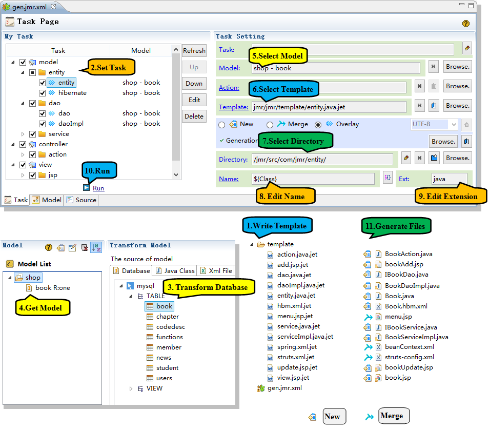
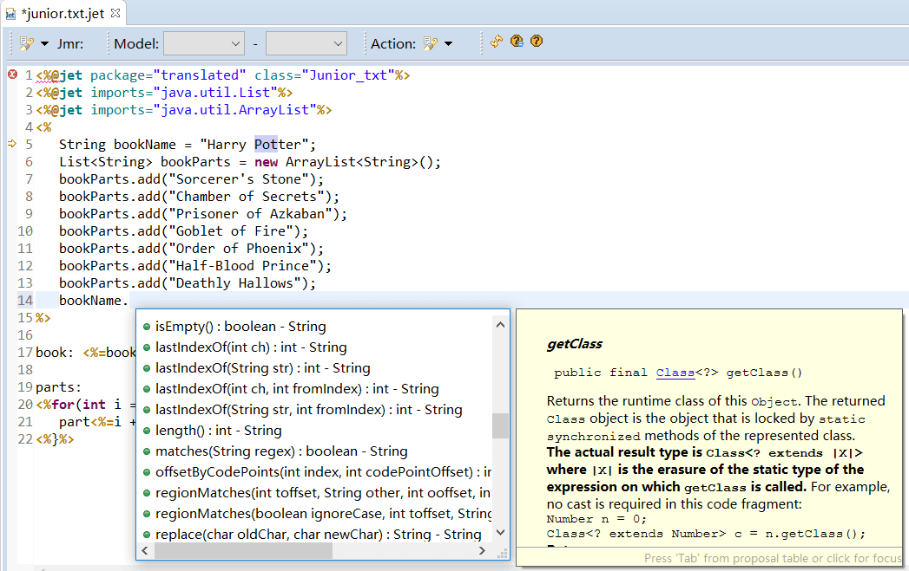
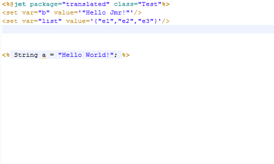
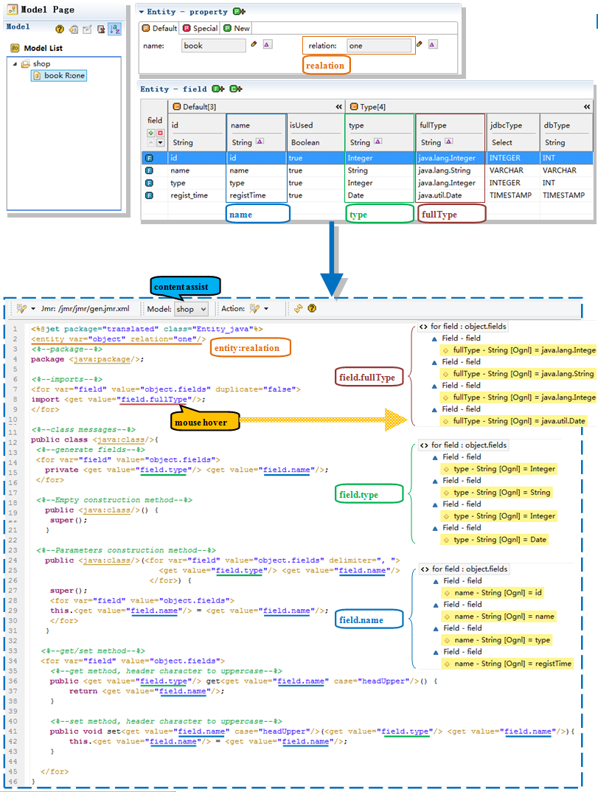
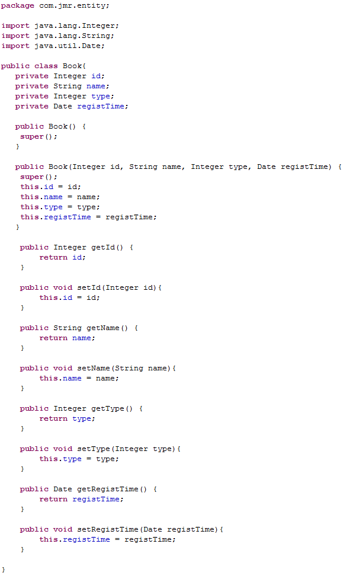
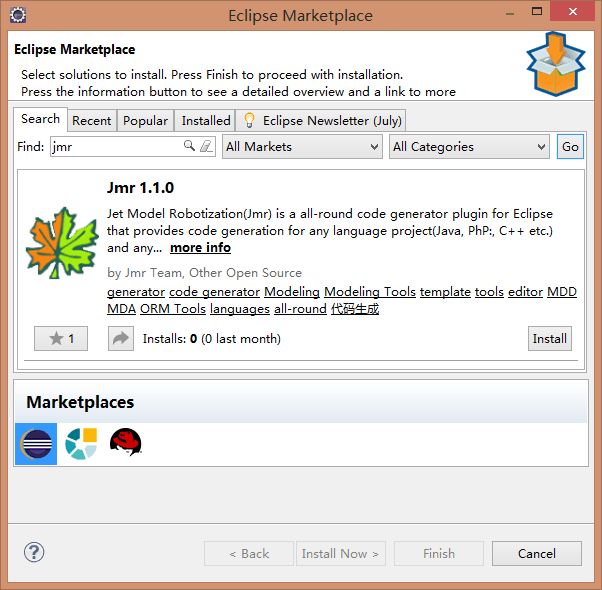

#Jmr

> Everything can be generated

[Install](#1) |
<a href="http://www.jmr-source.com" target="_blank">Home</a> | 
<a href="http://www.jmr-source.com/doc/en/index.html" target="_blank">Documentation</a> |
<a href="http://www.jmr-source.com/doc/zh/index.html">文档</a>
##What is Jmr?
Jmr’s full name is Jet Model Robotization, in Eclipse, any language (Java, Php, C++ etc.) project, any type of framework(struts, spring/springMVC, hiberate etc.), can use Jmr to generate code.

##What can Jmr do?

Any repetitive code can be automatically generated through Jmr. You only need to write templates and set tasks according to your own project and framework.

For example, here's a CRUD module, to generate all the code through the following steps.

1, Write Tempalte   
2, Set Task  
3, Get model(from database)  
4, Run

##Template
Jmr uses Jet as a template to generate code. JSP-like template files can be edited and transformed into any kind of source artifact including java, html, properties or xml files in a very simple way.

##Template Editor
Exclusive template editor, write templates better.

##Model to code

Generated entity class.

##Install

In the Eclipse menu bar, click Help -> Eclipse Marketplace. Search Jmr, click Install.

