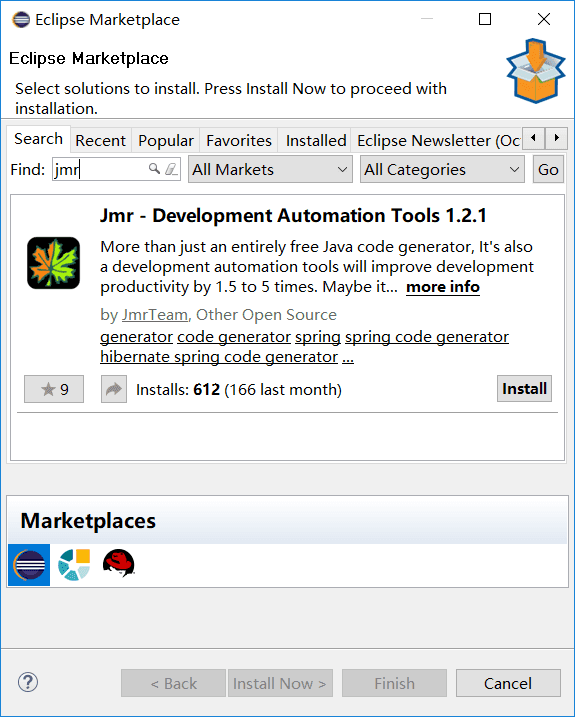

[English](README.md) | [中文](README.zh.md) 

# Jmr

> Everything can be generated

<a href="http://www.jmr-source.com" target="_blank">Home</a> | 
<a href="http://www.jmr-source.com/doc/en/index.html#html/install-and-uninstall.html" target="_blank">Installation Guide</a> |
<a href="http://www.jmr-source.com/doc/en/index.html" target="_blank">Documentation</a>

## Support IDE

 

###Eclipse  
version:1.3.1 
###Intellij IDEA
developing(Coming Soon) 
## What is Jmr?

More than just an entirely free Java code generator. 

Maybe it can become your "black technology" will improve development productivity by 1.5 to 5 times, Zero coupling to your project and without changing anything.

Jmr’s full name is Jet Model Robotization, in Eclipse or IDEA, any kind of project(Maven, Gradle, Java, React, Vue, Angular, Python, Php etc.), any kind of framework(springboot/spring/springMVC, hibernate, mybatis, struts, JPA etc.), can use Jmr to manage and generate code.

## What can Jmr do?

Any repetitive code can be automatically generated through Jmr. You only need to write templates and set tasks according to your own project and framework.

For example, here's a CRUD module, to generate all the code through the following steps.

1, Write Template   
2, Set Task  
3, Get model(from database)  
4, Run

## Template

Jmr uses Jet as a template to generate code. JSP-like template files can be edited and transformed into any kind of source artifact including java, html, properties or xml files in a very simple way.

## Install

In the Eclipse menu bar, click Help -> Eclipse Marketplace. Search Jmr, click Install.

