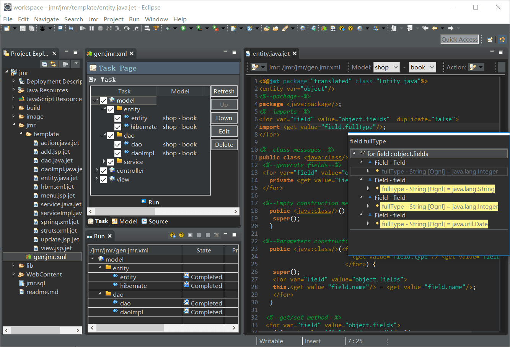
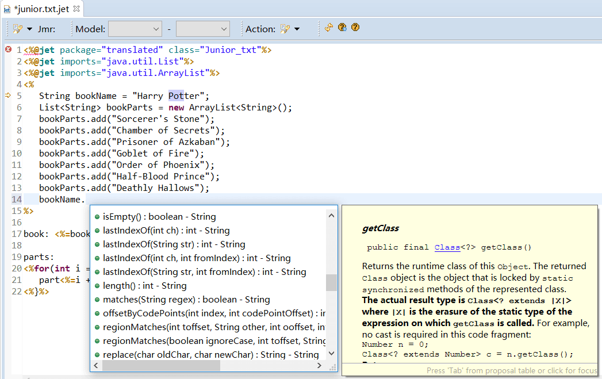

[English](README.md) | [中文](README.zh.md) 

# Jmr

> 万物皆可被生成

<a href="http://www.jmr-source.com" target="_blank">官网</a> | 
<a href="http://www.jmr-source.com/doc/zh/index.html#html/install-and-uninstall.html" target="_blank">安装说明</a> |
<a href="http://www.jmr-source.com/doc/zh/index.html">文档</a>

## Jmr是什么？

Jmr不仅仅是一款免费的Java代码生成工具，还是一款应用最新理念的自动化开发工具。

比普通代码生成器做得多得多，实现全程自动化开发。能够提升1.5~5倍的效率，在提升效率的同时，不必改变项目和框架，可以零耦合集成Jmr。

Jmr全称Jet Model Robotization，在Eclipse中，只要安装了Jmr插件，任何类型项目(Maven, Gradle, Web, Java, PHP, Python等等)的项目，任何类型的框架(spring/springMVC, hibernate, mybatis, struts, JPA等)，都可以使用Jmr来管理和生成代码。

## Jmr能做到什么？

Jmr能够把那些项目或框架中的重复的代码，实现自动化生成。只需要根基自己的项目或者框架编写模板，设置任务。

以一个增删查改模块为例，通过以下几步可以实现自动化生成。

1、编写模板   
2、设置任务  
3、得到模型（数据库）  
4、运行生成（模型注入模板）

## 模板

Jmr使用Jet作为模板语言，类似JSP的模板可以很容易上手，并生成各种类型的文件，如java、html、properties或者xml。

## 模板编辑器
专业的模板编辑器，让编写模板更得心应手。

## 模型转成代码

生成Java实体类。

## 安装

在Eclipse菜单栏中，点击Help -> Eclipse Marketplace，搜索Jmr，点击安装。

