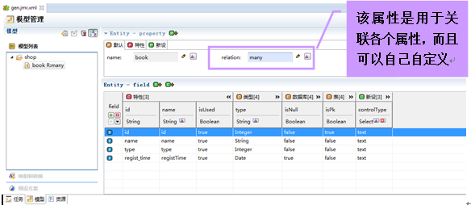

# 
java web项目
 #

### 项目配置 ###

----------

----------

### 实战操作 ###

以下是一个典型的java web项目，首先点击“File”—>“New”—>“Jmr”  

弹出对话框，新建Jmr文件  

接着点击新建的“gen.jmr.xml”，在“模型”视图里新建“组”  

弹出对话框，新建组  

点击“shop”组  

点击“新建连接”按钮，设置连接属性  

进行模型转换（之前已设置了一个预设方案(plan)，如需详细了解，可以点击此处）  

(mysql数据库表结构)  

模型转换后的页面显示的内容  

点击“任务”，设置“任务设定”的属性，然后勾选要运行的任务，接着点击“运行”（之前已设置模板，如需详细了解，可以点击此处）  

运行结果后，控制台将会把运行结果显示出来，并且可以做相应的操作

jmr生成的文件

jmr生成后的效果

